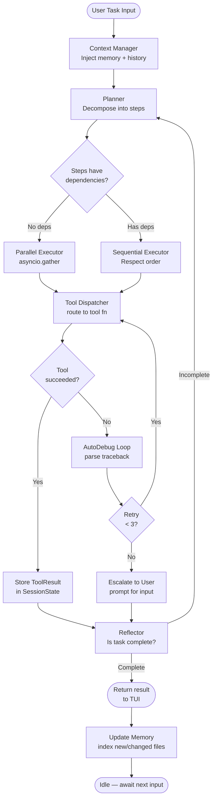

# Vanta Code — Complete Project Plan
> **The autonomous CLI coding agent with a soul.**

---

## ⚡ Quick Start for Agents (READ FIRST)

> **Every AI coding agent MUST read this entire document before writing a single line of code.**

Follow these directives without exception:

1. **Read this file completely** — top to bottom — before opening any editor or shell.
2. **Follow phases in order** — Phase 1 → Phase 2 → ... → Phase 5. Never jump ahead.
3. **Run tests after each phase** — Each phase has an acceptance criteria block with exact shell commands. Execute them all. Do not proceed until they pass.
4. **Never skip `vanta.toml` setup** — The config file is the spine of the entire system. Every module reads from it.
5. **Never hardcode secrets** — All API keys live in `.env`. Use `python-dotenv` to load them.
6. **All file writes go through `tools/file_tools.py`** — Never use raw `open()` calls in agent or TUI code.
7. **All LLM calls are async** — Use `asyncio` and `httpx.AsyncClient`. No blocking `requests` calls anywhere.
8. **Dry-run mode must work for every destructive operation** — Check `config.dry_run` before any write/delete/shell call.
9. **The agent must never delete files without user confirmation** — The `delete_file` tool must prompt before executing (unless `--force` flag is set).
10. **Cross-reference this document** — Each section links to others. Follow the links mentally; they define dependencies.

---

## Table of Contents

1. [Project Overview](#1-project-overview)
2. [Tech Stack](#2-tech-stack)
3. [Full Directory Structure](#3-full-directory-structure)
4. [Architecture & Agent Loop](#4-architecture--agent-loop)
5. [All Tool Definitions](#5-all-tool-definitions)
6. [TUI Interface Design](#6-tui-interface-design)
7. [Vanta Memory Brain](#7-vanta-memory-brain)
8. [LLM Backend & Routing](#8-llm-backend--routing)
9. [AutoDebug Loop](#9-autodebug-loop)
10. [CLI Commands Reference](#10-cli-commands-reference)
11. [Development Phases & Milestones](#11-development-phases--milestones)
12. [Data Models & Schemas](#12-data-models--schemas)
13. [Testing Strategy](#13-testing-strategy)
14. [Installation & Distribution](#14-installation--distribution)
15. [Vanta Personality Themes](#15-vanta-personality-themes)
16. [Future Roadmap](#16-future-roadmap)

---

## 1. Project Overview

### Vision

Vanta Code is a **fully autonomous terminal-based AI coding agent** that lives entirely inside your terminal. Unlike Claude Code (which is a thin wrapper around an LLM with file tools) or Cursor (which requires a GUI IDE), Vanta Code is designed from first principles to be:

- **Beautiful** — A rich, animated TUI that feels like a premium product, not a side project.
- **Autonomous** — The agent plans, executes, observes, and self-corrects without hand-holding.
- **Memory-native** — Every codebase it touches is indexed into a persistent knowledge graph. The agent remembers architecture decisions, function signatures, past bugs, and developer intent.
- **Multi-model** — Routes tasks to the best model (Groq for speed, Gemini for depth) based on complexity scoring.
- **Developer-first** — Every design decision prioritizes the working developer: keyboard shortcuts, vim-style nav, inline plots, one-command debug loops.

### What Makes Vanta Code Different

| Feature | Vanta Code | Claude Code | Cursor | Copilot CLI |
|---|---|---|---|---|
| Fully autonomous agent loop | ✅ Plan→Act→Observe→Reflect | Partial | Partial | ❌ |
| Persistent codebase memory (ChromaDB) | ✅ | ❌ | Partial | ❌ |
| Knowledge graph (NetworkX) | ✅ | ❌ | ❌ | ❌ |
| Inline terminal data plotting | ✅ | ❌ | ❌ | ❌ |
| Multi-model LLM routing | ✅ Groq + Gemini | Claude only | GPT-4/Claude | GitHub Models |
| AutoDebug loop (3-retry + backoff) | ✅ | Partial | ❌ | ❌ |
| Textual TUI with split panels | ✅ | ❌ | GUI only | ❌ |
| Personality themes (Hacker, Sakura) | ✅ | ❌ | ❌ | ❌ |
| Sub-agent parallel execution | ✅ | ❌ | ❌ | ❌ |
| `vanta.toml` project config | ✅ | ❌ | `.cursorrules` | ❌ |
| Dry-run mode for all writes | ✅ | ❌ | ❌ | ❌ |
| Works in WSL/Linux/macOS | ✅ | ✅ | GUI only | Partial |
| Git auto-commit with AI messages | ✅ | Partial | Partial | ❌ |

### Goals for v1.0

- Fully working agent loop with all 13 tools
- ChromaDB memory that persists across sessions
- Textual TUI with 3-panel layout, 2 themes minimum
- Groq + Gemini routing live
- AutoDebug loop with 3-retry strategy
- All 8 CLI commands functional
- `pipx install vanta-code` one-liner installation
- 80%+ test coverage

---

## 2. Tech Stack

> Every library listed below is **required**. Do not substitute without updating this document and all affected modules.

### Core Dependencies

| Library | Version | Purpose | Why Chosen |
|---|---|---|---|
| `python` | `>=3.11` | Runtime | Pattern matching, `tomllib` stdlib, `asyncio` improvements |
| `textual` | `^0.61.0` | TUI framework | Best-in-class terminal UI, reactive widgets, CSS-like styling |
| `rich` | `^13.7.0` | Text formatting, fallback renderer | Industry standard, powers Textual internals |
| `httpx` | `^0.27.0` | Async HTTP client for LLM APIs | Native async, better than `aiohttp` for REST |
| `groq` | `^0.9.0` | Groq API SDK | Official SDK, streaming support |
| `google-generativeai` | `^0.7.0` | Gemini API SDK | Official SDK, function calling support |
| `chromadb` | `^0.5.0` | Vector database for memory | Embedded, no server needed, Python-native |
| `sentence-transformers` | `^3.0.0` | Embedding generation | Local embeddings, no API cost |
| `networkx` | `^3.3` | Knowledge graph (codebase relationships) | Standard graph library, well-documented |
| `pydantic` | `^2.7.0` | Data validation and schemas | v2 is fast, required for all models |
| `typer` | `^0.12.0` | CLI framework | Built on Click, auto-docs, type hints |
| `python-dotenv` | `^1.0.0` | `.env` loading | Industry standard |
| `tomllib` | stdlib (3.11+) | `vanta.toml` parsing | Built-in, no dep needed |
| `pygments` | `^2.18.0` | Syntax highlighting in diffs | Powers Rich's code rendering |
| `gitpython` | `^3.1.43` | Git operations | Full Git interface from Python |
| `plotext` | `^5.2.8` | Inline terminal plots | ASCII/Unicode charts in terminal |
| `tree-sitter` | `^0.23.0` | Code parsing for indexing | Language-agnostic AST parsing |
| `ast` | stdlib | Python AST analysis | Built-in, for Python-specific indexing |
| `watchdog` | `^4.0.0` | File system watching | Detect file changes for live reload |
| `pytest` | `^8.2.0` | Test runner | Industry standard |
| `pytest-asyncio` | `^0.23.0` | Async test support | Required for async tool tests |
| `pytest-cov` | `^5.0.0` | Coverage reporting | CI gate |
| `respx` | `^0.21.0` | Mock `httpx` in tests | Best mock library for httpx |
| `ruff` | `^0.4.0` | Linting + formatting | Replaces flake8 + black + isort |
| `mypy` | `^1.10.0` | Static type checking | Enforce type safety |
| `anyio` | `^4.4.0` | Async compatibility layer | Works with asyncio and trio |

### Dev-Only Dependencies

| Library | Version | Purpose |
|---|---|---|
| `pytest` | `^8.2.0` | Testing |
| `pytest-asyncio` | `^0.23.0` | Async tests |
| `pytest-cov` | `^5.0.0` | Coverage |
| `respx` | `^0.21.0` | HTTP mocking |
| `mypy` | `^1.10.0` | Type checking |
| `ruff` | `^0.4.0` | Lint + format |

---

## 3. Full Directory Structure

```
vanta-code/
│
├── README.md                          # Public-facing readme with install + quickstart
├── plan.md                            # THIS FILE — single source of truth
├── pyproject.toml                     # Package metadata, deps, scripts entry point
├── .env.example                       # Template for required env vars
├── .gitignore                         # Excludes .env, __pycache__, .vanta/, dist/
├── ruff.toml                          # Ruff linting/formatting config
├── mypy.ini                           # Mypy type checking config
│
├── vanta/                             # Main package root
│   ├── __init__.py                    # Package init, exports VERSION constant
│   ├── __main__.py                    # Entry point: `python -m vanta`
│   │
│   ├── cli/                           # CLI layer (Typer commands)
│   │   ├── __init__.py
│   │   ├── app.py                     # Root Typer app, registers all subcommands
│   │   ├── cmd_init.py                # `vanta init` command implementation
│   │   ├── cmd_chat.py                # `vanta chat` command — launches TUI
│   │   ├── cmd_run.py                 # `vanta run "<task>"` one-shot execution
│   │   ├── cmd_plot.py                # `vanta plot <file>` — data plot pipeline
│   │   ├── cmd_debug.py               # `vanta debug` — manual debug trigger
│   │   ├── cmd_commit.py              # `vanta commit` — AI commit message + git
│   │   ├── cmd_search.py              # `vanta search "<query>"` — Doc Hunter
│   │   └── cmd_config.py              # `vanta config` — settings management
│   │
│   ├── agent/                         # Core agent loop and reasoning
│   │   ├── __init__.py
│   │   ├── loop.py                    # Main agent loop: plan→act→observe→reflect
│   │   ├── planner.py                 # Task decomposition and step planning
│   │   ├── executor.py                # Tool call dispatcher, result collector
│   │   ├── reflector.py               # Post-action reflection and self-correction
│   │   ├── context_manager.py         # Sliding window context + memory injection
│   │   ├── sub_agent.py               # Spawns async sub-agents for parallel tasks
│   │   └── prompt_builder.py          # Builds system + user prompts from templates
│   │
│   ├── tools/                         # All agent-callable tools
│   │   ├── __init__.py                # Exports TOOL_REGISTRY dict
│   │   ├── registry.py                # Tool registration decorator + schema gen
│   │   ├── file_tools.py              # read_file, write_file, patch_file, create_file, delete_file
│   │   ├── shell_tools.py             # run_shell, run_tests
│   │   ├── search_tools.py            # search_codebase, web_search_docs
│   │   ├── git_tools.py               # git_commit, git_status, git_diff
│   │   ├── plot_tools.py              # plot_data — inline terminal charts
│   │   ├── debug_tools.py             # auto_debug — traceback parsing + retry
│   │   └── nav_tools.py               # list_directory, find_file
│   │
│   ├── llm/                           # LLM backend + routing
│   │   ├── __init__.py
│   │   ├── router.py                  # Task complexity scorer + model selector
│   │   ├── groq_client.py             # Async Groq API client + streaming
│   │   ├── gemini_client.py           # Async Gemini API client + streaming
│   │   ├── base_client.py             # Abstract base class for all LLM clients
│   │   ├── token_budget.py            # Token counting, context window management
│   │   └── stream_handler.py          # Unified streaming response handler
│   │
│   ├── memory/                        # Vanta Memory Brain
│   │   ├── __init__.py
│   │   ├── indexer.py                 # Codebase walking + chunking + embedding
│   │   ├── chroma_store.py            # ChromaDB client wrapper
│   │   ├── graph.py                   # NetworkX knowledge graph: files, functions, deps
│   │   ├── embedder.py                # SentenceTransformer embedding generation
│   │   └── retriever.py               # Query interface: similarity + graph traversal
│   │
│   ├── tui/                           # Textual TUI application
│   │   ├── __init__.py
│   │   ├── app.py                     # Root Textual App class
│   │   ├── panels/
│   │   │   ├── __init__.py
│   │   │   ├── file_tree.py           # Left panel: interactive file tree widget
│   │   │   ├── chat_panel.py          # Center panel: chat history + diff renderer
│   │   │   └── terminal_panel.py      # Right panel: shell output, spinners, logs
│   │   ├── widgets/
│   │   │   ├── __init__.py
│   │   │   ├── diff_viewer.py         # Syntax-highlighted unified diff widget
│   │   │   ├── plot_widget.py         # Inline plot rendering widget (plotext)
│   │   │   ├── status_bar.py          # Bottom status bar with spinner + model info
│   │   │   ├── input_bar.py           # Multi-line input with history
│   │   │   └── confirm_dialog.py      # Modal confirmation dialog (delete, overwrite)
│   │   └── themes/
│   │       ├── __init__.py
│   │       ├── classic.tcss           # Vanta Classic dark theme CSS
│   │       ├── hacker.tcss            # Vanta Hacker green-on-black theme CSS
│   │       └── sakura.tcss            # Vanta Sakura pink/purple theme CSS
│   │
│   ├── config/                        # Config management
│   │   ├── __init__.py
│   │   ├── loader.py                  # Load + validate vanta.toml + .env
│   │   ├── schema.py                  # VantaConfig Pydantic model
│   │   └── defaults.py                # All default config values
│   │
│   └── utils/                         # Shared utilities
│       ├── __init__.py
│       ├── logger.py                  # Structured logging with Rich handler
│       ├── spinner.py                 # Async spinner context manager
│       ├── diff.py                    # Unified diff generation utility
│       ├── ast_utils.py               # Python AST helpers for indexing
│       └── fs.py                      # Safe filesystem helpers (mkdirs, atomic write)
│
├── prompts/                           # LLM prompt templates (Jinja2-style .txt)
│   ├── system_base.txt                # Base system prompt for all sessions
│   ├── planner.txt                    # Prompt for task decomposition
│   ├── reflector.txt                  # Prompt for post-action reflection
│   ├── debugger.txt                   # Prompt for AutoDebug loop
│   ├── commit_message.txt             # Prompt for git commit message generation
│   └── doc_search.txt                 # Prompt for documentation search summarization
│
├── tests/                             # Full test suite
│   ├── __init__.py
│   ├── conftest.py                    # Shared fixtures: tmp dirs, mock LLM, config
│   ├── unit/
│   │   ├── test_file_tools.py         # Unit tests for all file tools
│   │   ├── test_shell_tools.py        # Unit tests for shell + test runner tools
│   │   ├── test_git_tools.py          # Unit tests for git tools
│   │   ├── test_plot_tools.py         # Unit tests for plot tool
│   │   ├── test_debug_tools.py        # Unit tests for AutoDebug
│   │   ├── test_router.py             # Unit tests for LLM router
│   │   ├── test_token_budget.py       # Token counting tests
│   │   ├── test_indexer.py            # Memory indexer tests
│   │   ├── test_retriever.py          # Memory retrieval tests
│   │   └── test_config.py             # Config loading + validation tests
│   ├── integration/
│   │   ├── test_agent_loop.py         # Full agent loop integration tests
│   │   ├── test_memory_pipeline.py    # Index → query full pipeline
│   │   └── test_tui_smoke.py          # TUI startup/render smoke tests
│   └── fixtures/
│       ├── sample_project/            # Minimal Python project for indexer tests
│       │   ├── main.py
│       │   └── utils.py
│       └── sample_traceback.txt       # Example traceback for debug tests
│
└── .vanta/                            # Runtime data directory (gitignored)
    ├── chroma/                        # ChromaDB persistent storage
    ├── graph.pkl                      # Serialized NetworkX graph
    ├── session.json                   # Current session state
    └── logs/
        └── vanta.log                  # Rotating log file
```

---

## 4. Architecture & Agent Loop

### Overview

The Vanta Code agent operates on a **Plan → Act → Observe → Reflect** loop. This is the fundamental reasoning cycle that drives all autonomous behavior. The loop runs until the agent determines the task is complete, hits a hard error it cannot recover from, or the user interrupts.

### The Four Phases

#### 1. Plan
The **Planner** (`agent/planner.py`) receives the user's task as a natural language string. It calls the LLM with a structured prompt that asks it to decompose the task into a numbered list of atomic steps. Each step is tagged with:
- `step_id`: UUID
- `description`: Human-readable action
- `tool`: Which tool will be called
- `depends_on`: List of `step_id`s that must complete first (enables parallelism)
- `estimated_complexity`: `low | medium | high`

#### 2. Act
The **Executor** (`agent/executor.py`) takes the plan and dispatches tool calls. Steps with no dependencies run concurrently using `asyncio.gather()`. Each tool call is wrapped in a `ToolCall` Pydantic model (see [Section 12](#12-data-models--schemas)) and dispatched through `tools/registry.py`.

#### 3. Observe
After each tool call completes, the result is stored in the `SessionState` as a `ToolResult`. The executor feeds the result back to the LLM as a message in the conversation history. This allows the LLM to see what happened and adjust its plan.

#### 4. Reflect
After all steps in the current plan complete (or after a failed step), the **Reflector** (`agent/reflector.py`) runs. It asks the LLM: "Given the results of the steps just executed, is the original task complete? If not, what needs to happen next?" The Reflector either:
- Marks the task as complete and returns control to the user
- Generates a new sub-plan for the remaining work
- Triggers the AutoDebug loop if a tool returned an error

### Mermaid Flowchart



### Context Management

`agent/context_manager.py` maintains a sliding window of messages that fits within the model's token budget. It:

1. Loads the base system prompt from `prompts/system_base.txt`
2. Appends the `vanta.toml` project context (language, conventions, excluded paths)
3. Queries the Memory Brain for the top-5 most relevant chunks to the current task
4. Appends the last N messages from `SessionState.history` where N is calculated to stay under `config.llm.context_budget` tokens
5. Appends the current user message

The full context is assembled as a list of `{"role": ..., "content": ...}` dicts and passed to the LLM client.

### Sub-Agent Parallelism

For steps tagged `can_parallelize: true` by the Planner, `agent/sub_agent.py` spawns concurrent async tasks using `asyncio.create_task()`. Each sub-agent has its own isolated `executor` instance but shares the same `SessionState` (protected by `asyncio.Lock`). Sub-agent results are aggregated and returned to the main loop.

```python
# agent/sub_agent.py — SubAgent class signature
import asyncio
from vanta.agent.executor import Executor
from vanta.models import AgentMessage, ToolResult, SessionState

class SubAgent:
    def __init__(self, executor: Executor, state: SessionState, lock: asyncio.Lock):
        self.executor = executor
        self.state = state
        self.lock = lock

    async def run_step(self, step: dict) -> ToolResult:
        """Execute a single step in isolation. Thread-safe via lock."""
        result = await self.executor.dispatch(step)
        async with self.lock:
            self.state.results.append(result)
        return result
```

### Tool Calling Protocol

The agent uses a structured JSON schema for tool calls. When the LLM wants to call a tool, it outputs a JSON block that the executor parses:

```json
{
  "tool": "write_file",
  "params": {
    "path": "src/utils.py",
    "content": "def add(a, b):\n    return a + b\n"
  }
}
```

The executor validates this against the tool's Pydantic schema, calls the function, and returns a `ToolResult` with `success`, `output`, and `error` fields. The result is serialized back to JSON and added to the conversation as a `tool` role message.

---

## 5. All Tool Definitions

> All tools live in `vanta/tools/`. Each tool is registered via the `@tool` decorator from `tools/registry.py`.

### Tool Registry

```python
# tools/registry.py
from typing import Callable, Any
from vanta.models import ToolCall, ToolResult

TOOL_REGISTRY: dict[str, Callable] = {}

def tool(name: str, description: str):
    """Decorator that registers a function as an agent tool."""
    def decorator(fn: Callable) -> Callable:
        TOOL_REGISTRY[name] = {
            "fn": fn,
            "description": description,
            "schema": _build_schema(fn),
        }
        return fn
    return decorator

def _build_schema(fn: Callable) -> dict:
    """Auto-generate JSON schema from function type hints."""
    import inspect, typing
    sig = inspect.signature(fn)
    properties = {}
    required = []
    for param_name, param in sig.parameters.items():
        if param_name in ("config", "state"):
            continue
        annotation = param.annotation
        prop = {"type": _python_type_to_json(annotation)}
        if param.default is inspect.Parameter.empty:
            required.append(param_name)
        properties[param_name] = prop
    return {
        "type": "object",
        "properties": properties,
        "required": required,
    }

async def dispatch(call: ToolCall, config, state) -> ToolResult:
    """Look up and call the tool. Return ToolResult."""
    entry = TOOL_REGISTRY.get(call.tool)
    if not entry:
        return ToolResult(success=False, output="", error=f"Unknown tool: {call.tool}")
    try:
        result = await entry["fn"](**call.params, config=config, state=state)
        return ToolResult(success=True, output=str(result), error=None)
    except Exception as e:
        return ToolResult(success=False, output="", error=str(e))
```

---

### Tool: `read_file`

**Description:** Read the full text content of a file at the given path. Returns the file content as a string.

**Function Signature:**
```python
# tools/file_tools.py
async def read_file(
    path: str,
    start_line: int | None = None,
    end_line: int | None = None,
    config = None,
    state = None,
) -> str:
```

**Parameters:**

| Name | Type | Description | Required |
|---|---|---|---|
| `path` | `str` | Absolute or relative (to cwd) file path | ✅ |
| `start_line` | `int \| None` | First line to read (1-indexed). None = start | ❌ |
| `end_line` | `int \| None` | Last line to read (inclusive). None = EOF | ❌ |

**Returns:** `str` — File content (or selected lines). Raises `FileNotFoundError` if path does not exist.

**Example Usage:**
```json
{"tool": "read_file", "params": {"path": "src/main.py", "start_line": 10, "end_line": 40}}
```

**Implementation:**
```python
from pathlib import Path

@tool("read_file", "Read file content, optionally sliced by line range")
async def read_file(path: str, start_line: int | None = None, end_line: int | None = None, config=None, state=None) -> str:
    p = Path(path).resolve()
    if not p.exists():
        raise FileNotFoundError(f"read_file: {path} does not exist")
    lines = p.read_text(encoding="utf-8").splitlines(keepends=True)
    if start_line is not None or end_line is not None:
        s = (start_line - 1) if start_line else 0
        e = end_line if end_line else len(lines)
        lines = lines[s:e]
    return "".join(lines)
```

---

### Tool: `write_file`

**Description:** Write content to a file, creating it if it doesn't exist. Overwrites the full file content. Respects `--dry-run`.

**Function Signature:**
```python
async def write_file(
    path: str,
    content: str,
    config=None,
    state=None,
) -> str:
```

**Parameters:**

| Name | Type | Description | Required |
|---|---|---|---|
| `path` | `str` | File path to write to | ✅ |
| `content` | `str` | Full file content to write | ✅ |

**Returns:** `str` — Success message with path and bytes written, or dry-run notice.

**Implementation:**
```python
from vanta.utils.fs import atomic_write

@tool("write_file", "Write full content to a file. Creates parent dirs if needed.")
async def write_file(path: str, content: str, config=None, state=None) -> str:
    p = Path(path).resolve()
    if config and config.dry_run:
        return f"[DRY RUN] Would write {len(content)} bytes to {p}"
    p.parent.mkdir(parents=True, exist_ok=True)
    await atomic_write(p, content)
    return f"Wrote {len(content)} bytes to {p}"
```

---

### Tool: `patch_file`

**Description:** Apply a unified diff patch to an existing file. The patch must be in standard unified diff format (`--- a/file +++ b/file`). This is the preferred tool for editing existing files — use it instead of `write_file` when only parts of a file change.

**Function Signature:**
```python
async def patch_file(
    path: str,
    patch: str,
    config=None,
    state=None,
) -> str:
```

**Parameters:**

| Name | Type | Description | Required |
|---|---|---|---|
| `path` | `str` | Target file path | ✅ |
| `patch` | `str` | Unified diff string | ✅ |

**Returns:** `str` — Lines changed or dry-run notice.

**Implementation:**
```python
import patch as patch_lib  # `pip install patch`

@tool("patch_file", "Apply a unified diff patch to a file.")
async def patch_file(path: str, patch: str, config=None, state=None) -> str:
    p = Path(path).resolve()
    if not p.exists():
        raise FileNotFoundError(f"patch_file: {path} not found")
    if config and config.dry_run:
        return f"[DRY RUN] Would apply patch to {p}"
    ps = patch_lib.fromstring(patch.encode())
    if not ps.apply(root=str(p.parent)):
        raise RuntimeError("Patch application failed — check diff format")
    return f"Patch applied to {p}"
```

---

### Tool: `create_file`

**Description:** Create a new file with optional initial content. Fails if the file already exists (use `write_file` to overwrite).

**Function Signature:**
```python
async def create_file(
    path: str,
    content: str = "",
    config=None,
    state=None,
) -> str:
```

**Parameters:**

| Name | Type | Description | Required |
|---|---|---|---|
| `path` | `str` | New file path | ✅ |
| `content` | `str` | Initial content (default empty) | ❌ |

**Returns:** `str` — Confirmation or dry-run notice.

**Implementation:**
```python
@tool("create_file", "Create a new file. Fails if file already exists.")
async def create_file(path: str, content: str = "", config=None, state=None) -> str:
    p = Path(path).resolve()
    if p.exists():
        raise FileExistsError(f"create_file: {path} already exists. Use write_file to overwrite.")
    if config and config.dry_run:
        return f"[DRY RUN] Would create {p}"
    p.parent.mkdir(parents=True, exist_ok=True)
    p.write_text(content, encoding="utf-8")
    return f"Created {p} ({len(content)} bytes)"
```

---

### Tool: `delete_file`

**Description:** Delete a file. **Always prompts the user for confirmation unless `force=True`.** This tool will never silently delete a file.

**Function Signature:**
```python
async def delete_file(
    path: str,
    force: bool = False,
    config=None,
    state=None,
) -> str:
```

**Parameters:**

| Name | Type | Description | Required |
|---|---|---|---|
| `path` | `str` | File to delete | ✅ |
| `force` | `bool` | Skip confirmation (only for programmatic use) | ❌ |

**Returns:** `str` — Confirmation or cancellation notice.

**Implementation:**
```python
from vanta.tui.widgets.confirm_dialog import prompt_confirm

@tool("delete_file", "Delete a file. Prompts for confirmation unless force=True.")
async def delete_file(path: str, force: bool = False, config=None, state=None) -> str:
    p = Path(path).resolve()
    if not p.exists():
        raise FileNotFoundError(f"delete_file: {path} not found")
    if config and config.dry_run:
        return f"[DRY RUN] Would delete {p}"
    if not force:
        confirmed = await prompt_confirm(f"Delete {p}? This cannot be undone.")
        if not confirmed:
            return f"Deletion of {p} cancelled by user."
    p.unlink()
    return f"Deleted {p}"
```

---

### Tool: `run_shell`

**Description:** Execute a shell command in the project root directory. Captures stdout and stderr. Times out after `timeout` seconds.

**Function Signature:**
```python
async def run_shell(
    command: str,
    cwd: str | None = None,
    timeout: int = 30,
    config=None,
    state=None,
) -> dict:
```

**Parameters:**

| Name | Type | Description | Required |
|---|---|---|---|
| `command` | `str` | Shell command string | ✅ |
| `cwd` | `str \| None` | Working directory (default: project root) | ❌ |
| `timeout` | `int` | Max seconds to wait (default 30) | ❌ |

**Returns:** `dict` with keys `stdout: str`, `stderr: str`, `returncode: int`.

**Implementation:**
```python
import asyncio
import shlex

@tool("run_shell", "Run a shell command and capture output.")
async def run_shell(command: str, cwd: str | None = None, timeout: int = 30, config=None, state=None) -> dict:
    if config and config.dry_run:
        return {"stdout": f"[DRY RUN] Would run: {command}", "stderr": "", "returncode": 0}
    work_dir = cwd or (config.project_root if config else ".")
    proc = await asyncio.create_subprocess_shell(
        command,
        stdout=asyncio.subprocess.PIPE,
        stderr=asyncio.subprocess.PIPE,
        cwd=work_dir,
    )
    try:
        stdout, stderr = await asyncio.wait_for(proc.communicate(), timeout=timeout)
    except asyncio.TimeoutError:
        proc.kill()
        return {"stdout": "", "stderr": f"Command timed out after {timeout}s", "returncode": -1}
    return {
        "stdout": stdout.decode("utf-8", errors="replace"),
        "stderr": stderr.decode("utf-8", errors="replace"),
        "returncode": proc.returncode,
    }
```

---

### Tool: `search_codebase`

**Description:** Semantic search over the indexed codebase using ChromaDB. Returns the top-k most relevant code chunks to the query.

**Function Signature:**
```python
async def search_codebase(
    query: str,
    top_k: int = 5,
    file_filter: str | None = None,
    config=None,
    state=None,
) -> list[dict]:
```

**Parameters:**

| Name | Type | Description | Required |
|---|---|---|---|
| `query` | `str` | Natural language or code query | ✅ |
| `top_k` | `int` | Number of results to return (default 5) | ❌ |
| `file_filter` | `str \| None` | Glob pattern to restrict search (e.g. `*.py`) | ❌ |

**Returns:** `list[dict]` — Each dict has `file`, `lines`, `content`, `score`.

**Implementation:**
```python
from vanta.memory.retriever import Retriever

@tool("search_codebase", "Semantic search over the indexed codebase.")
async def search_codebase(query: str, top_k: int = 5, file_filter: str | None = None, config=None, state=None) -> list[dict]:
    retriever = Retriever(config=config)
    results = await retriever.query(query, top_k=top_k, file_filter=file_filter)
    return results
```

---

### Tool: `plot_data`

**Description:** Render an inline ASCII/Unicode chart in the terminal using plotext. Supports line, bar, scatter, and histogram types.

**Function Signature:**
```python
async def plot_data(
    data: list[float] | list[list[float]],
    chart_type: str = "line",
    title: str = "",
    x_label: str = "",
    y_label: str = "",
    width: int = 80,
    height: int = 24,
    config=None,
    state=None,
) -> str:
```

**Parameters:**

| Name | Type | Description | Required |
|---|---|---|---|
| `data` | `list[float] \| list[list[float]]` | Y values (or [X, Y] pairs for scatter) | ✅ |
| `chart_type` | `str` | `line`, `bar`, `scatter`, `hist` | ❌ |
| `title` | `str` | Chart title | ❌ |
| `x_label` | `str` | X-axis label | ❌ |
| `y_label` | `str` | Y-axis label | ❌ |
| `width` | `int` | Terminal width in chars (default 80) | ❌ |
| `height` | `int` | Terminal height in rows (default 24) | ❌ |

**Returns:** `str` — Rendered chart as a string (for embedding in TUI widget).

**Implementation:**
```python
import plotext as plt
import io, sys

@tool("plot_data", "Render an inline terminal chart with plotext.")
async def plot_data(data, chart_type="line", title="", x_label="", y_label="", width=80, height=24, config=None, state=None) -> str:
    plt.clf()
    plt.plotsize(width, height)
    plt.title(title)
    plt.xlabel(x_label)
    plt.ylabel(y_label)
    if chart_type == "line":
        plt.plot(data)
    elif chart_type == "bar":
        plt.bar(data)
    elif chart_type == "scatter":
        if isinstance(data[0], (list, tuple)):
            plt.scatter([d[0] for d in data], [d[1] for d in data])
        else:
            plt.scatter(data)
    elif chart_type == "hist":
        plt.hist(data)
    else:
        raise ValueError(f"Unknown chart_type: {chart_type}")
    buf = io.StringIO()
    old_stdout = sys.stdout
    sys.stdout = buf
    plt.show()
    sys.stdout = old_stdout
    return buf.getvalue()
```

---

### Tool: `web_search_docs`

**Description:** Search for documentation, API references, and Stack Overflow answers using a web search API. Summarizes the top 3 results into a concise answer.

**Function Signature:**
```python
async def web_search_docs(
    query: str,
    max_results: int = 3,
    config=None,
    state=None,
) -> str:
```

**Parameters:**

| Name | Type | Description | Required |
|---|---|---|---|
| `query` | `str` | Documentation search query | ✅ |
| `max_results` | `int` | Number of results to fetch (default 3) | ❌ |

**Returns:** `str` — Summarized documentation answer.

**Implementation:**
```python
import httpx

SEARXNG_INSTANCE = "https://searx.be"  # Public SearXNG instance — no API key needed

@tool("web_search_docs", "Search for documentation and summarize results.")
async def web_search_docs(query: str, max_results: int = 3, config=None, state=None) -> str:
    async with httpx.AsyncClient(timeout=10) as client:
        resp = await client.get(
            f"{SEARXNG_INSTANCE}/search",
            params={"q": query, "format": "json", "categories": "general"},
        )
        resp.raise_for_status()
        results = resp.json().get("results", [])[:max_results]
    snippets = "\n\n".join(
        f"**{r['title']}** ({r.get('url', '')})\n{r.get('content', '')}"
        for r in results
    )
    # Summarize via LLM
    from vanta.llm.router import route_query
    summary = await route_query(
        task=f"Summarize these search results for the query '{query}':\n{snippets}",
        complexity="low",
        config=config,
    )
    return summary
```

---

### Tool: `git_commit`

**Description:** Stage all changed files and create a git commit with an AI-generated message based on the diff.

**Function Signature:**
```python
async def git_commit(
    message: str | None = None,
    files: list[str] | None = None,
    config=None,
    state=None,
) -> str:
```

**Parameters:**

| Name | Type | Description | Required |
|---|---|---|---|
| `message` | `str \| None` | Commit message. If None, AI generates one | ❌ |
| `files` | `list[str] \| None` | Files to stage. If None, stages all changes | ❌ |

**Returns:** `str` — Commit hash and message.

**Implementation:**
```python
from git import Repo
from vanta.llm.router import route_query

@tool("git_commit", "Stage files and commit with AI-generated message.")
async def git_commit(message: str | None = None, files: list[str] | None = None, config=None, state=None) -> str:
    repo = Repo(config.project_root if config else ".")
    if files:
        repo.index.add(files)
    else:
        repo.git.add("-A")
    if not message:
        diff = repo.git.diff("--cached")
        message = await route_query(
            task=f"Write a concise git commit message for this diff:\n{diff[:3000]}",
            complexity="low",
            config=config,
        )
        message = message.strip().strip('"')
    if config and config.dry_run:
        return f"[DRY RUN] Would commit: {message}"
    commit = repo.index.commit(message)
    return f"Committed {commit.hexsha[:8]}: {message}"
```

---

### Tool: `list_directory`

**Description:** List the contents of a directory with optional recursion. Returns a tree-formatted string.

**Function Signature:**
```python
async def list_directory(
    path: str = ".",
    recursive: bool = False,
    max_depth: int = 3,
    show_hidden: bool = False,
    config=None,
    state=None,
) -> str:
```

**Parameters:**

| Name | Type | Description | Required |
|---|---|---|---|
| `path` | `str` | Directory path (default current dir) | ❌ |
| `recursive` | `bool` | Recurse into subdirectories | ❌ |
| `max_depth` | `int` | Max recursion depth (default 3) | ❌ |
| `show_hidden` | `bool` | Include dotfiles | ❌ |

**Returns:** `str` — Tree-formatted directory listing.

---

### Tool: `run_tests`

**Description:** Run the project's test suite (pytest by default) and return the output. Triggers AutoDebug if tests fail.

**Function Signature:**
```python
async def run_tests(
    path: str = "tests/",
    pattern: str = "test_*.py",
    verbose: bool = False,
    config=None,
    state=None,
) -> dict:
```

**Parameters:**

| Name | Type | Description | Required |
|---|---|---|---|
| `path` | `str` | Test directory or file | ❌ |
| `pattern` | `str` | File name glob pattern | ❌ |
| `verbose` | `bool` | Run with `-v` flag | ❌ |

**Returns:** `dict` with `passed: int`, `failed: int`, `errors: int`, `output: str`.

**Implementation:**
```python
@tool("run_tests", "Run pytest and return results. Triggers AutoDebug on failure.")
async def run_tests(path: str = "tests/", pattern: str = "test_*.py", verbose: bool = False, config=None, state=None) -> dict:
    flags = "-v" if verbose else ""
    result = await run_shell(f"python -m pytest {path} {flags} --tb=short -q", config=config, state=state)
    output = result["stdout"] + result["stderr"]
    passed = output.count(" passed")
    failed = output.count(" failed")
    errors = output.count(" error")
    return {"passed": passed, "failed": failed, "errors": errors, "output": output}
```

---

### Tool: `auto_debug`

**Description:** Automatically diagnose and fix a traceback or error. Parses the error, searches the codebase for the offending code, generates a fix, applies it, and retries up to 3 times. See [Section 9](#9-autodebug-loop) for full loop details.

**Function Signature:**
```python
async def auto_debug(
    traceback: str,
    context_files: list[str] | None = None,
    max_attempts: int = 3,
    config=None,
    state=None,
) -> dict:
```

**Parameters:**

| Name | Type | Description | Required |
|---|---|---|---|
| `traceback` | `str` | Full error traceback string | ✅ |
| `context_files` | `list[str] \| None` | Files to include as context | ❌ |
| `max_attempts` | `int` | Max fix attempts (default 3) | ❌ |

**Returns:** `dict` with `fixed: bool`, `attempts: int`, `patch_applied: str | None`, `message: str`.

---

## 6. TUI Interface Design

### Overview

The TUI is built with **Textual** (`^0.61.0`). The root app lives in `tui/app.py`. The interface degrades gracefully: if Textual is unavailable, all output falls back to `rich.Console` printing.

### Panel Layout

```
┌─────────────────────────────────────────────────────────────────────┐
│  VANTA CODE  v1.0  ░ project: myapp  ░ model: groq/llama3  ░ mem:87% │  ← Header bar
├────────────────┬──────────────────────────────┬─────────────────────┤
│                │                              │                     │
│   FILE TREE    │      CHAT + DIFFS            │   TERMINAL OUTPUT   │
│   (Left 20%)   │      (Center 55%)            │   (Right 25%)       │
│                │                              │                     │
│  📁 src/       │  ┌─ User ──────────────────┐ │  $ pytest tests/    │
│    📄 main.py  │  │ Add a cache decorator   │ │  ✓ 24 passed        │
│    📄 utils.py │  └─────────────────────────┘ │  ✗ 2 failed         │
│  📁 tests/     │                              │                     │
│    📄 test_    │  ┌─ Vanta ─────────────────┐ │  AutoDebug running  │
│       main.py  │  │ Planning 3 steps...     │ │  ░░░░░░░░░░ 60%     │
│                │  │ ✓ read_file main.py     │ │                     │
│  [MEMORY: 87%] │  │ ✓ patch_file main.py   │ │  [stderr]           │
│                │  │   ┌──── DIFF ─────────┐ │ │  TypeError: ...     │
│                │  │   │ - def old_fn():   │ │ │                     │
│                │  │   │ + def new_fn():   │ │ │                     │
│                │  │   │ +     @lru_cache  │ │ │                     │
│                │  │   └───────────────────┘ │ │                     │
│                │  └─────────────────────────┘ │                     │
├────────────────┴──────────────────────────────┴─────────────────────┤
│  > Type your message or /command...           [Ctrl+Enter to send]   │  ← Input bar
└─────────────────────────────────────────────────────────────────────┘
```

### Textual App Structure

```python
# tui/app.py
from textual.app import App, ComposeResult
from textual.widgets import Header, Footer
from textual.containers import Horizontal
from vanta.tui.panels.file_tree import FileTreePanel
from vanta.tui.panels.chat_panel import ChatPanel
from vanta.tui.panels.terminal_panel import TerminalPanel
from vanta.tui.widgets.status_bar import StatusBar
from vanta.tui.widgets.input_bar import InputBar

class VantaApp(App):
    CSS_PATH = "themes/classic.tcss"  # Swapped based on config.theme
    BINDINGS = [
        ("ctrl+q", "quit", "Quit"),
        ("ctrl+t", "toggle_theme", "Theme"),
        ("ctrl+f", "focus_file_tree", "Files"),
        ("ctrl+l", "clear_chat", "Clear"),
        ("ctrl+k", "show_shortcuts", "Keys"),
        ("ctrl+enter", "send_message", "Send"),
        ("ctrl+z", "undo_last", "Undo"),
        ("f1", "toggle_memory_panel", "Memory"),
        ("f2", "toggle_terminal", "Terminal"),
        ("ctrl+p", "open_command_palette", "Commands"),
    ]

    def compose(self) -> ComposeResult:
        yield Header(show_clock=True)
        with Horizontal():
            yield FileTreePanel(id="file-tree")
            yield ChatPanel(id="chat")
            yield TerminalPanel(id="terminal")
        yield InputBar(id="input")
        yield StatusBar(id="status")

    async def on_mount(self) -> None:
        await self.load_session()
        self.query_one("#input").focus()

    def action_toggle_theme(self) -> None:
        themes = ["classic", "hacker", "sakura"]
        current = self.app_css_path.stem
        next_theme = themes[(themes.index(current) + 1) % len(themes)]
        self.set_css_path(f"themes/{next_theme}.tcss")
```

### Color Theme Specifications

#### Vanta Classic (Professional Dark)

```css
/* tui/themes/classic.tcss */
$bg-primary: #0d1117;
$bg-secondary: #161b22;
$bg-tertiary: #21262d;
$border: #30363d;
$accent: #58a6ff;
$accent-hover: #79beff;
$text-primary: #e6edf3;
$text-secondary: #8b949e;
$text-muted: #484f58;
$success: #3fb950;
$warning: #d29922;
$error: #f85149;
$diff-add: #1a4a1a;
$diff-add-text: #3fb950;
$diff-remove: #4a1a1a;
$diff-remove-text: #f85149;
$spinner: #58a6ff;
```

#### Vanta Hacker (Green-on-Black)

```css
/* tui/themes/hacker.tcss */
$bg-primary: #000000;
$bg-secondary: #001a00;
$bg-tertiary: #003300;
$border: #00ff41;
$accent: #00ff41;
$accent-hover: #39ff74;
$text-primary: #00ff41;
$text-secondary: #00cc33;
$text-muted: #005900;
$success: #00ff41;
$warning: #ffff00;
$error: #ff0000;
$diff-add: #001a00;
$diff-add-text: #00ff41;
$diff-remove: #1a0000;
$diff-remove-text: #ff0000;
$spinner: #00ff41;
```

#### Vanta Sakura (Pink/Purple Aesthetic)

```css
/* tui/themes/sakura.tcss */
$bg-primary: #0d0a14;
$bg-secondary: #16102a;
$bg-tertiary: #1e1535;
$border: #c9a0dc;
$accent: #ff79c6;
$accent-hover: #ff92d5;
$text-primary: #f8f8f2;
$text-secondary: #bd93f9;
$text-muted: #6272a4;
$success: #50fa7b;
$warning: #ffb86c;
$error: #ff5555;
$diff-add: #1a0d1a;
$diff-add-text: #50fa7b;
$diff-remove: #1a0d0d;
$diff-remove-text: #ff5555;
$spinner: #ff79c6;
```

### Keyboard Shortcuts Table

| Shortcut | Action | Context |
|---|---|---|
| `Ctrl+Enter` | Send message | Input focused |
| `Ctrl+Q` | Quit Vanta | Global |
| `Ctrl+T` | Cycle theme | Global |
| `Ctrl+F` | Focus file tree | Global |
| `Ctrl+L` | Clear chat history | Chat panel |
| `Ctrl+K` | Show shortcut help | Global |
| `Ctrl+Z` | Undo last agent action | Global |
| `Ctrl+P` | Command palette | Global |
| `F1` | Toggle memory panel overlay | Global |
| `F2` | Toggle terminal panel | Global |
| `↑ / ↓` | Navigate input history | Input focused |
| `Ctrl+C` (×2) | Force quit | Global |
| `/help` | Show slash command list | Input |
| `/plan` | Show current agent plan | Input |
| `/clear` | Clear session | Input |
| `/theme <name>` | Switch theme inline | Input |
| `/dry-run toggle` | Toggle dry-run mode | Input |

### Syntax-Highlighted Diffs

Diffs are rendered in `tui/widgets/diff_viewer.py` using `rich.syntax.Syntax` with custom color overrides. The diff viewer:

1. Receives a unified diff string from `utils/diff.py`
2. Splits into `+`, `-`, and ` ` (context) lines
3. Renders `+` lines with `$diff-add-text` foreground on `$diff-add` background
4. Renders `-` lines with `$diff-remove-text` foreground on `$diff-remove` background
5. Shows file header (`--- a/... +++ b/...`) in `$text-muted`
6. Applies language-specific syntax highlighting to the content using Pygments

```python
# tui/widgets/diff_viewer.py
from textual.widget import Widget
from textual.app import RenderResult
from rich.text import Text
from rich.syntax import Syntax

class DiffViewer(Widget):
    def __init__(self, diff_str: str, language: str = "python"):
        super().__init__()
        self.diff_str = diff_str
        self.language = language

    def render(self) -> RenderResult:
        text = Text()
        for line in self.diff_str.splitlines():
            if line.startswith("+") and not line.startswith("+++"):
                text.append(line + "\n", style="bold green on dark_green")
            elif line.startswith("-") and not line.startswith("---"):
                text.append(line + "\n", style="bold red on dark_red")
            elif line.startswith("@@"):
                text.append(line + "\n", style="cyan")
            elif line.startswith("---") or line.startswith("+++"):
                text.append(line + "\n", style="dim")
            else:
                text.append(line + "\n", style="")
        return text
```

### Animated Status Indicators

The `StatusBar` widget shows the current agent state with animated spinners:

```python
# tui/widgets/status_bar.py
from textual.widget import Widget
from textual.reactive import reactive
from rich.spinner import Spinner

SPINNER_STATES = {
    "idle":       ("✓", "green",   "Ready"),
    "planning":   ("◆", "blue",    "Planning..."),
    "acting":     ("●", "yellow",  "Acting..."),
    "reflecting": ("◇", "cyan",    "Reflecting..."),
    "debugging":  ("✗", "red",     "Debugging..."),
    "indexing":   ("⊙", "magenta", "Indexing..."),
    "thinking":   ("~", "white",   "Thinking..."),
}
```

### Inline Plot Rendering

The `PlotWidget` (`tui/widgets/plot_widget.py`) receives a chart string from `plot_data` tool and renders it inside a scrollable `Static` widget. The widget auto-detects terminal width and requests the appropriate `width` from the `plot_data` tool.

---

## 7. Vanta Memory Brain

### Overview

The Memory Brain is a two-layer system:
1. **ChromaDB** — Vector store for semantic similarity search over code chunks
2. **NetworkX** — Knowledge graph mapping relationships between files, functions, classes, and imports

Both are stored in `.vanta/` in the project root and persist across sessions.

### Initialization: `vanta init`

When the user runs `vanta init`, `memory/indexer.py` performs the following steps:

1. **Walk the project** — Recursively walk all files, respecting `vanta.toml` `memory.exclude_patterns`
2. **Filter by language** — Only index files matching `memory.include_extensions`
3. **Chunk each file** — Split into overlapping chunks of `memory.chunk_size` tokens with `memory.chunk_overlap` overlap
4. **Generate embeddings** — Use `SentenceTransformer('all-MiniLM-L6-v2')` locally (no API calls)
5. **Store in ChromaDB** — Each chunk stored with metadata: `file`, `start_line`, `end_line`, `language`
6. **Build NetworkX graph** — Parse imports, function defs, class defs using `ast` (Python) or Tree-sitter (others)
7. **Serialize graph** — Save to `.vanta/graph.pkl` using `pickle`

### Embedder

```python
# memory/embedder.py
from sentence_transformers import SentenceTransformer
from functools import lru_cache

MODEL_NAME = "all-MiniLM-L6-v2"

@lru_cache(maxsize=1)
def get_embedder() -> SentenceTransformer:
    return SentenceTransformer(MODEL_NAME)

def embed(texts: list[str]) -> list[list[float]]:
    model = get_embedder()
    return model.encode(texts, show_progress_bar=False).tolist()
```

### ChromaDB Client

```python
# memory/chroma_store.py
import chromadb
from pathlib import Path

class ChromaStore:
    def __init__(self, persist_dir: str):
        self.client = chromadb.PersistentClient(path=persist_dir)
        self.collection = self.client.get_or_create_collection(
            name="vanta_codebase",
            metadata={"hnsw:space": "cosine"},
        )

    def upsert(self, ids: list[str], embeddings: list[list[float]], documents: list[str], metadatas: list[dict]):
        self.collection.upsert(ids=ids, embeddings=embeddings, documents=documents, metadatas=metadatas)

    def query(self, embedding: list[float], top_k: int = 5, where: dict | None = None) -> list[dict]:
        results = self.collection.query(
            query_embeddings=[embedding],
            n_results=top_k,
            where=where,
            include=["documents", "metadatas", "distances"],
        )
        output = []
        for i, doc in enumerate(results["documents"][0]):
            output.append({
                "content": doc,
                "file": results["metadatas"][0][i].get("file"),
                "start_line": results["metadatas"][0][i].get("start_line"),
                "end_line": results["metadatas"][0][i].get("end_line"),
                "score": 1 - results["distances"][0][i],
            })
        return output
```

### Knowledge Graph

```python
# memory/graph.py
import networkx as nx
import pickle
from pathlib import Path

class CodeGraph:
    def __init__(self, graph_path: str):
        self.path = Path(graph_path)
        self.G = self._load()

    def _load(self) -> nx.DiGraph:
        if self.path.exists():
            with open(self.path, "rb") as f:
                return pickle.load(f)
        return nx.DiGraph()

    def save(self):
        with open(self.path, "wb") as f:
            pickle.dump(self.G, f)

    def add_file(self, path: str, language: str):
        self.G.add_node(path, type="file", language=language)

    def add_function(self, name: str, file: str, start_line: int, end_line: int):
        node_id = f"{file}::{name}"
        self.G.add_node(node_id, type="function", file=file, start=start_line, end=end_line)
        self.G.add_edge(file, node_id, relation="defines")

    def add_import(self, from_file: str, imported_module: str):
        self.G.add_edge(from_file, imported_module, relation="imports")

    def get_related(self, file: str, depth: int = 2) -> list[str]:
        """Get all nodes within `depth` hops from a file."""
        nodes = set()
        for node in nx.ego_graph(self.G, file, radius=depth, undirected=True).nodes():
            nodes.add(node)
        return list(nodes - {file})
```

### Retriever

```python
# memory/retriever.py
from vanta.memory.chroma_store import ChromaStore
from vanta.memory.embedder import embed
from vanta.memory.graph import CodeGraph

class Retriever:
    def __init__(self, config):
        self.store = ChromaStore(config.memory.chroma_path)
        self.graph = CodeGraph(config.memory.graph_path)

    async def query(self, text: str, top_k: int = 5, file_filter: str | None = None) -> list[dict]:
        emb = embed([text])[0]
        where = None
        if file_filter:
            import fnmatch
            where = {"file": {"$contains": file_filter.replace("*", "")}}
        results = self.store.query(emb, top_k=top_k, where=where)
        # Augment with graph neighbors
        for r in results:
            if r["file"]:
                r["related_files"] = self.graph.get_related(r["file"], depth=1)
        return results
```

### `vanta.toml` Config Schema

```toml
# vanta.toml — Full specification with all keys

[project]
name = "my-project"                      # Project display name
language = "python"                      # Primary language: python | typescript | rust | go
conventions = "Use type hints everywhere, docstrings for public functions."
root = "."                               # Project root (relative to vanta.toml location)

[llm]
provider = "groq"                        # Primary: groq | gemini
fallback_provider = "gemini"             # Used when primary fails or task complexity > threshold
groq_model = "llama3-70b-8192"          # Groq model ID
gemini_model = "gemini-1.5-flash"       # Gemini model ID
context_budget = 6000                    # Max tokens in context window
complexity_threshold = 0.7              # Score 0-1 above which Gemini is used
temperature = 0.2                        # LLM temperature (lower = more deterministic)
max_tokens = 4096                        # Max tokens in LLM response

[memory]
enabled = true                           # Enable/disable memory brain
chroma_path = ".vanta/chroma"           # Path to ChromaDB storage
graph_path = ".vanta/graph.pkl"         # Path to NetworkX graph
chunk_size = 512                         # Tokens per chunk
chunk_overlap = 64                       # Token overlap between chunks
include_extensions = [".py", ".ts", ".js", ".rs", ".go", ".md", ".toml", ".yaml"]
exclude_patterns = ["**/node_modules/**", "**/__pycache__/**", "**/.venv/**", "**/dist/**", "**/.git/**"]
embedding_model = "all-MiniLM-L6-v2"   # SentenceTransformer model

[tui]
theme = "classic"                        # classic | hacker | sakura
panel_widths = [20, 55, 25]             # Left, center, right percentages
show_file_tree = true
show_terminal = true
show_memory_bar = true
max_chat_history = 200                   # Max messages to display

[agent]
max_steps = 50                           # Max steps per task before halt
max_retries = 3                          # AutoDebug max retries
dry_run = false                          # If true, no writes/deletes/shell executed
auto_commit = false                      # Auto-commit after each task
verbose_tools = false                    # Print all tool calls to terminal panel

[git]
auto_stage = true                        # Auto-stage files on git_commit
sign_commits = false                     # GPG sign commits
branch_prefix = "vanta/"                # Branch prefix for agent-created branches

[search]
searxng_url = "https://searx.be"        # SearXNG instance for doc search
max_results = 3                          # Web search results to fetch

[debug]
log_level = "INFO"                       # DEBUG | INFO | WARNING | ERROR
log_file = ".vanta/logs/vanta.log"      # Log file path
log_rotation = "10 MB"                  # Rotate when log exceeds this size
```

---

## 8. LLM Backend & Routing

### Router Logic

The router (`llm/router.py`) scores each task on a complexity scale of 0.0 to 1.0 and selects the appropriate model.

```python
# llm/router.py
import re
from vanta.config.schema import VantaConfig

COMPLEXITY_SIGNALS = {
    "high": ["refactor", "architect", "design", "entire codebase", "migrate", "optimize performance", "security audit"],
    "medium": ["implement", "add feature", "fix bug", "write tests", "debug"],
    "low": ["explain", "summarize", "list", "what is", "rename", "format", "add comment"],
}

def score_complexity(task: str) -> float:
    task_lower = task.lower()
    for word in COMPLEXITY_SIGNALS["high"]:
        if word in task_lower:
            return 0.9
    for word in COMPLEXITY_SIGNALS["medium"]:
        if word in task_lower:
            return 0.5
    return 0.2

async def route_query(task: str, complexity: str | None = None, config: VantaConfig | None = None) -> str:
    if complexity == "high" or (config and score_complexity(task) >= config.llm.complexity_threshold):
        from vanta.llm.gemini_client import GeminiClient
        client = GeminiClient(config=config)
    else:
        from vanta.llm.groq_client import GroqClient
        client = GroqClient(config=config)
    return await client.complete(task)
```

### Groq Client

```python
# llm/groq_client.py
import httpx
from vanta.llm.base_client import BaseLLMClient

class GroqClient(BaseLLMClient):
    BASE_URL = "https://api.groq.com/openai/v1/chat/completions"

    def __init__(self, config=None):
        self.config = config
        self.model = config.llm.groq_model if config else "llama3-70b-8192"
        import os
        self.api_key = os.getenv("GROQ_API_KEY")
        if not self.api_key:
            raise ValueError("GROQ_API_KEY not set in .env")

    async def complete(self, prompt: str, system: str = "", stream: bool = False) -> str:
        messages = []
        if system:
            messages.append({"role": "system", "content": system})
        messages.append({"role": "user", "content": prompt})
        async with httpx.AsyncClient(timeout=60) as client:
            resp = await client.post(
                self.BASE_URL,
                headers={"Authorization": f"Bearer {self.api_key}", "Content-Type": "application/json"},
                json={
                    "model": self.model,
                    "messages": messages,
                    "max_tokens": self.config.llm.max_tokens if self.config else 4096,
                    "temperature": self.config.llm.temperature if self.config else 0.2,
                    "stream": stream,
                },
            )
            resp.raise_for_status()
            data = resp.json()
            return data["choices"][0]["message"]["content"]

    async def stream_complete(self, prompt: str, system: str = ""):
        """Yield tokens as they stream from Groq."""
        messages = [{"role": "user", "content": prompt}]
        if system:
            messages.insert(0, {"role": "system", "content": system})
        async with httpx.AsyncClient(timeout=120) as client:
            async with client.stream(
                "POST",
                self.BASE_URL,
                headers={"Authorization": f"Bearer {self.api_key}"},
                json={"model": self.model, "messages": messages, "stream": True},
            ) as resp:
                async for line in resp.aiter_lines():
                    if line.startswith("data: ") and line != "data: [DONE]":
                        import json
                        chunk = json.loads(line[6:])
                        delta = chunk["choices"][0]["delta"].get("content", "")
                        if delta:
                            yield delta
```

### Gemini Client

```python
# llm/gemini_client.py
import httpx
import os
from vanta.llm.base_client import BaseLLMClient

class GeminiClient(BaseLLMClient):
    BASE_URL = "https://generativelanguage.googleapis.com/v1beta/models/{model}:generateContent"

    def __init__(self, config=None):
        self.config = config
        self.model = config.llm.gemini_model if config else "gemini-1.5-flash"
        self.api_key = os.getenv("GEMINI_API_KEY")
        if not self.api_key:
            raise ValueError("GEMINI_API_KEY not set in .env")

    async def complete(self, prompt: str, system: str = "", stream: bool = False) -> str:
        url = self.BASE_URL.format(model=self.model) + f"?key={self.api_key}"
        payload = {
            "contents": [{"role": "user", "parts": [{"text": prompt}]}],
            "generationConfig": {
                "maxOutputTokens": self.config.llm.max_tokens if self.config else 4096,
                "temperature": self.config.llm.temperature if self.config else 0.2,
            },
        }
        if system:
            payload["systemInstruction"] = {"parts": [{"text": system}]}
        async with httpx.AsyncClient(timeout=90) as client:
            resp = await client.post(url, json=payload)
            resp.raise_for_status()
            data = resp.json()
            return data["candidates"][0]["content"]["parts"][0]["text"]
```

### Base Client Abstract Class

```python
# llm/base_client.py
from abc import ABC, abstractmethod

class BaseLLMClient(ABC):
    @abstractmethod
    async def complete(self, prompt: str, system: str = "", stream: bool = False) -> str:
        """Make a completion request. Return full response text."""
        ...

    async def stream_complete(self, prompt: str, system: str = ""):
        """Yield response tokens. Default: buffer and yield once."""
        result = await self.complete(prompt, system=system)
        yield result
```

### Token Budget Management

```python
# llm/token_budget.py

def count_tokens(text: str) -> int:
    """Approximate token count: ~4 chars per token for English code."""
    return max(1, len(text) // 4)

def trim_messages_to_budget(messages: list[dict], budget: int) -> list[dict]:
    """
    Trim message history to fit within token budget.
    Always keeps: system message (index 0) and last user message.
    Removes oldest middle messages first.
    """
    total = sum(count_tokens(m["content"]) for m in messages)
    if total <= budget:
        return messages
    # Keep system + last user, trim from the middle
    result = [messages[0]]  # system
    tail = [messages[-1]]   # current user message
    middle = list(messages[1:-1])
    while middle and total > budget:
        removed = middle.pop(0)
        total -= count_tokens(removed["content"])
    return result + middle + tail
```

---

## 9. AutoDebug Loop

### Overview

The AutoDebug loop is triggered when:
1. A tool call returns a non-zero exit code from `run_shell`
2. `run_tests` reports failures
3. The agent explicitly calls `auto_debug` with a traceback

### Step-by-Step Logic

#### Step 1: Parse Traceback

`debug_tools.py` extracts from the traceback:
- **Error type**: e.g., `TypeError`, `ImportError`, `AttributeError`
- **Error message**: The text after the error type
- **File path**: The last `File "..."` line in the traceback
- **Line number**: The line where the error occurred
- **Offending code snippet**: Read using `read_file` with ±5 lines of context

```python
import re
from pathlib import Path

def parse_traceback(tb: str) -> dict:
    """Extract structured info from a Python traceback."""
    file_matches = re.findall(r'File "(.+?)", line (\d+)', tb)
    error_match = re.search(r'(\w+Error|\w+Exception): (.+)$', tb, re.MULTILINE)
    last_file, last_line = file_matches[-1] if file_matches else (None, None)
    return {
        "error_type": error_match.group(1) if error_match else "UnknownError",
        "error_message": error_match.group(2) if error_match else tb.strip().splitlines()[-1],
        "file": last_file,
        "line": int(last_line) if last_line else None,
        "frames": file_matches,
    }
```

#### Step 2: Classify Error

Map error types to fix strategies:

| Error Type | Strategy |
|---|---|
| `ImportError` / `ModuleNotFoundError` | Check imports, add `pip install`, fix import path |
| `TypeError` | Check function signature, argument types |
| `AttributeError` | Check object type, method existence |
| `KeyError` / `IndexError` | Add bounds checking, validate key existence |
| `SyntaxError` | Fix syntax at reported line |
| `FileNotFoundError` | Create missing file or fix path |
| `AssertionError` | Fix failing assertion logic |
| `RuntimeError` | Inspect logic, check state |

#### Step 3: Generate Fix

Build a fix prompt and call the LLM:

```python
async def generate_fix(parsed: dict, context_code: str, attempt: int, config) -> str:
    from vanta.llm.router import route_query
    prompt = f"""
You are an expert Python debugger. Fix the following error.

Error Type: {parsed['error_type']}
Error Message: {parsed['error_message']}
File: {parsed['file']}, Line: {parsed['line']}
Attempt: {attempt + 1}/3

Offending code:
```python
{context_code}
```

Return ONLY the fixed code block for the function or section that contains the bug.
Do not include explanation. Do not include any text outside the code block.
"""
    return await route_query(task=prompt, complexity="medium", config=config)
```

#### Step 4: Apply and Validate

```python
async def apply_and_validate(fix_code: str, parsed: dict, config, state) -> bool:
    """Write fix, run tests, return True if tests pass."""
    if not parsed["file"]:
        return False
    # Write the fix
    original = await read_file(parsed["file"], config=config, state=state)
    patched = _splice_fix(original, fix_code, parsed["line"])
    await write_file(parsed["file"], patched, config=config, state=state)
    # Run tests
    result = await run_tests(config=config, state=state)
    return result["failed"] == 0 and result["errors"] == 0
```

#### Step 5: Retry with Backoff

```python
async def auto_debug(traceback: str, context_files=None, max_attempts=3, config=None, state=None) -> dict:
    import asyncio
    parsed = parse_traceback(traceback)
    context_code = ""
    if parsed["file"] and parsed["line"]:
        start = max(1, parsed["line"] - 5)
        end = parsed["line"] + 10
        context_code = await read_file(parsed["file"], start_line=start, end_line=end, config=config)

    for attempt in range(max_attempts):
        backoff = 2 ** attempt  # 1s, 2s, 4s
        await asyncio.sleep(backoff)
        fix_code = await generate_fix(parsed, context_code, attempt, config)
        success = await apply_and_validate(fix_code, parsed, config, state)
        if success:
            return {
                "fixed": True,
                "attempts": attempt + 1,
                "patch_applied": fix_code,
                "message": f"Fixed on attempt {attempt + 1}",
            }

    # All attempts failed — escalate
    return {
        "fixed": False,
        "attempts": max_attempts,
        "patch_applied": None,
        "message": f"AutoDebug exhausted {max_attempts} attempts. Manual intervention required.",
    }
```

#### Step 6: Escalation

If all 3 attempts fail, the agent:
1. Rolls back all file changes made during the debug loop (using `git checkout -- <file>`)
2. Presents the user with a `DebugAttempt` summary showing what was tried
3. Shows the original traceback with syntax highlighting
4. Asks the user: "Would you like to (1) try a different approach, (2) skip this step, or (3) provide a hint?"

---

## 10. CLI Commands Reference

### `vanta init`

**Description:** Initialize Vanta Code for the current project. Creates `.vanta/`, generates `vanta.toml`, and indexes the codebase into ChromaDB + NetworkX.

**Flags:**

| Flag | Default | Description |
|---|---|---|
| `--path` | `.` | Project root to initialize |
| `--force` | `False` | Re-index even if `.vanta/` already exists |
| `--no-index` | `False` | Create config only, skip indexing |
| `--theme` | `classic` | Default theme: `classic \| hacker \| sakura` |
| `--dry-run` | `False` | Show what would be created without doing it |

**Example:**
```bash
cd my-project
vanta init --theme hacker
```

**Expected Output:**
```
 Vanta Code v1.0 — Initializing...
 Created .vanta/
 Generated vanta.toml
 Indexing codebase...
   Scanning: 47 files found
   Chunking: 312 chunks
   Embedding: ████████████████████ 100%
   Graph: 89 nodes, 134 edges
 Done in 12.3s — Run `vanta chat` to start.
```

**Implementation (`cli/cmd_init.py`):**
```python
import typer
from pathlib import Path
from rich.console import Console
from vanta.memory.indexer import Indexer
from vanta.config.defaults import DEFAULT_TOML

app = typer.Typer()
console = Console()

@app.command()
def init(
    path: str = typer.Option(".", help="Project root"),
    force: bool = typer.Option(False, help="Re-index if exists"),
    no_index: bool = typer.Option(False, "--no-index"),
    theme: str = typer.Option("classic"),
    dry_run: bool = typer.Option(False, "--dry-run"),
):
    root = Path(path).resolve()
    vanta_dir = root / ".vanta"
    if vanta_dir.exists() and not force:
        console.print("[yellow]Already initialized. Use --force to re-index.[/yellow]")
        raise typer.Exit()
    if not dry_run:
        vanta_dir.mkdir(exist_ok=True)
        (root / "vanta.toml").write_text(DEFAULT_TOML.format(theme=theme))
    if not no_index and not dry_run:
        import asyncio
        indexer = Indexer(project_root=str(root))
        asyncio.run(indexer.run())
    console.print("[green]Done![/green] Run `vanta chat` to start.")
```

---

### `vanta chat`

**Description:** Launch the full Textual TUI for an interactive session. Loads existing session state and memory.

**Flags:**

| Flag | Default | Description |
|---|---|---|
| `--theme` | from `vanta.toml` | Override theme for this session |
| `--model` | from `vanta.toml` | Override LLM model |
| `--no-memory` | `False` | Disable memory retrieval for this session |
| `--plain` | `False` | Use plain Rich output (no Textual TUI) |

**Example:**
```bash
vanta chat --theme hacker
```

**Expected Output:** Launches the 3-panel TUI.

**Implementation (`cli/cmd_chat.py`):**
```python
@app.command()
def chat(
    theme: str | None = typer.Option(None),
    model: str | None = typer.Option(None),
    no_memory: bool = typer.Option(False),
    plain: bool = typer.Option(False),
):
    from vanta.config.loader import load_config
    config = load_config()
    if theme:
        config.tui.theme = theme
    if model:
        config.llm.groq_model = model
    if plain:
        from vanta.agent.loop import run_plain_mode
        import asyncio
        asyncio.run(run_plain_mode(config))
    else:
        try:
            from vanta.tui.app import VantaApp
            VantaApp(config=config).run()
        except ImportError:
            console.print("[yellow]Textual not available. Falling back to plain mode.[/yellow]")
            from vanta.agent.loop import run_plain_mode
            import asyncio
            asyncio.run(run_plain_mode(config))
```

---

### `vanta run "<task>"`

**Description:** One-shot task execution. The agent plans and executes the task non-interactively, then exits. Output is printed to stdout.

**Flags:**

| Flag | Default | Description |
|---|---|---|
| `--dry-run` | `False` | Simulate without file writes |
| `--verbose` | `False` | Print all tool calls |
| `--no-memory` | `False` | Skip memory retrieval |
| `--output-file` | `None` | Save agent output to file |

**Example:**
```bash
vanta run "Add type hints to all functions in src/utils.py" --verbose
```

**Expected Output:**
```
 Vanta Code — Running task...
 Plan:
   1. read_file src/utils.py
   2. patch_file src/utils.py (add type hints)
   3. run_tests tests/test_utils.py

 Step 1/3: read_file src/utils.py ... done
 Step 2/3: patch_file src/utils.py ... done (18 lines changed)
 Step 3/3: run_tests ... 12 passed

 Task complete in 8.2s.
```

---

### `vanta plot <file>`

**Description:** Read a CSV or JSON data file and render an inline terminal chart.

**Flags:**

| Flag | Default | Description |
|---|---|---|
| `--type` | `line` | Chart type: `line \| bar \| scatter \| hist` |
| `--title` | `""` | Chart title |
| `--x` | `None` | Column name for X axis (CSV) |
| `--y` | `None` | Column name for Y axis (CSV) |
| `--width` | `80` | Chart width |
| `--height` | `24` | Chart height |

**Example:**
```bash
vanta plot data/sales.csv --type bar --x month --y revenue --title "Monthly Revenue"
```

---

### `vanta debug`

**Description:** Read the most recent traceback from the terminal or a file, and run the AutoDebug loop manually.

**Flags:**

| Flag | Default | Description |
|---|---|---|
| `--file` | `None` | Read traceback from file instead of stdin |
| `--max-attempts` | `3` | Max fix attempts |
| `--dry-run` | `False` | Show fix without applying |

**Example:**
```bash
python main.py 2>&1 | vanta debug
# or
vanta debug --file error.log
```

---

### `vanta commit`

**Description:** Stage all changes, generate an AI commit message, and create a git commit.

**Flags:**

| Flag | Default | Description |
|---|---|---|
| `--message` | `None` | Override AI message with your own |
| `--files` | all | Specific files to stage |
| `--push` | `False` | Push to remote after commit |
| `--dry-run` | `False` | Show message without committing |

**Example:**
```bash
vanta commit --push
```

**Expected Output:**
```
 Staged 4 files (183 lines changed)
 AI Message: "feat: add type hints and docstrings to utils.py"
 Committed: abc1234
 Pushed to origin/main
```

---

### `vanta search "<query>"`

**Description:** Search documentation sites, PyPI, and Stack Overflow for the given query. Summarizes results inline.

**Flags:**

| Flag | Default | Description |
|---|---|---|
| `--site` | `all` | Restrict to: `pypi \| so \| docs \| all` |
| `--max-results` | `3` | Number of results to fetch |

**Example:**
```bash
vanta search "chromadb upsert batch size limit"
```

---

### `vanta config`

**Description:** View and edit `vanta.toml` settings from the CLI.

**Subcommands:**

| Subcommand | Description |
|---|---|
| `vanta config show` | Pretty-print current config |
| `vanta config set <key> <value>` | Set a config value (e.g. `vanta config set tui.theme hacker`) |
| `vanta config reset` | Reset to default config |

**Example:**
```bash
vanta config set llm.temperature 0.1
vanta config show
```

---

## 11. Development Phases & Milestones

### Phase 1: Foundation (Week 1)

**Goal:** Working CLI with config loading, file tools, and shell tools. No TUI yet.

**Files to Create:**
- `pyproject.toml`
- `.env.example`
- `vanta/__init__.py`, `vanta/__main__.py`
- `vanta/cli/app.py`, `cmd_init.py`, `cmd_run.py`
- `vanta/config/loader.py`, `schema.py`, `defaults.py`
- `vanta/tools/registry.py`, `file_tools.py`, `shell_tools.py`, `nav_tools.py`
- `vanta/utils/logger.py`, `fs.py`, `diff.py`
- `tests/unit/test_file_tools.py`, `test_shell_tools.py`
- `tests/conftest.py`

**Acceptance Criteria:**
```bash
# 1. Package installs without errors
pip install -e .

# 2. Init command runs
vanta init --path /tmp/test-project --no-index

# 3. File tools work
python -c "
import asyncio
from vanta.tools.file_tools import write_file, read_file
async def test():
    await write_file('/tmp/test.py', 'x = 1\n')
    content = await read_file('/tmp/test.py')
    assert content == 'x = 1\n', f'Got: {content}'
    print('PASS')
asyncio.run(test())
"

# 4. Shell tool works
python -c "
import asyncio
from vanta.tools.shell_tools import run_shell
async def test():
    result = await run_shell('echo hello')
    assert result['stdout'].strip() == 'hello'
    print('PASS')
asyncio.run(test())
"

# 5. Unit tests pass
pytest tests/unit/test_file_tools.py tests/unit/test_shell_tools.py -v
```

---

### Phase 2: LLM + Agent Loop (Week 2)

**Goal:** Working agent loop with Groq + Gemini, all 13 tools, router.

**Files to Create:**
- `vanta/llm/base_client.py`, `groq_client.py`, `gemini_client.py`, `router.py`, `token_budget.py`, `stream_handler.py`
- `vanta/agent/loop.py`, `planner.py`, `executor.py`, `reflector.py`, `context_manager.py`, `sub_agent.py`, `prompt_builder.py`
- `vanta/tools/git_tools.py`, `plot_tools.py`, `debug_tools.py`, `search_tools.py`
- `prompts/system_base.txt`, `planner.txt`, `reflector.txt`, `debugger.txt`
- `tests/unit/test_router.py`, `test_token_budget.py`
- `tests/integration/test_agent_loop.py`

**Acceptance Criteria:**
```bash
# 1. Groq API returns a response
export GROQ_API_KEY=your_key
python -c "
import asyncio
from vanta.llm.groq_client import GroqClient
async def test():
    client = GroqClient()
    result = await client.complete('Say hello in 5 words.')
    print(f'PASS: {result}')
asyncio.run(test())
"

# 2. Router selects correct model
python -c "
from vanta.llm.router import score_complexity
assert score_complexity('explain what a list is') < 0.5
assert score_complexity('refactor the entire codebase') >= 0.8
print('PASS')
"

# 3. One-shot agent run works
vanta run 'Create a file hello.py with a hello_world() function' --dry-run

# 4. Agent loop integration test
pytest tests/integration/test_agent_loop.py -v
```

---

### Phase 3: Memory Brain (Week 3)

**Goal:** Working ChromaDB + NetworkX system. `vanta init` indexes a real project.

**Files to Create:**
- `vanta/memory/indexer.py`, `chroma_store.py`, `graph.py`, `embedder.py`, `retriever.py`
- `vanta/utils/ast_utils.py`
- `tests/fixtures/sample_project/`
- `tests/unit/test_indexer.py`, `test_retriever.py`
- `tests/integration/test_memory_pipeline.py`

**Acceptance Criteria:**
```bash
# 1. Index runs on sample project
vanta init --path tests/fixtures/sample_project

# 2. Retriever returns results
python -c "
import asyncio
from vanta.memory.retriever import Retriever
from vanta.config.loader import load_config
async def test():
    config = load_config('tests/fixtures/sample_project/vanta.toml')
    retriever = Retriever(config=config)
    results = await retriever.query('utility functions', top_k=3)
    assert len(results) > 0
    print(f'PASS: {len(results)} results')
asyncio.run(test())
"

# 3. Graph has nodes
python -c "
from vanta.memory.graph import CodeGraph
g = CodeGraph('.vanta/graph.pkl')
print(f'Nodes: {g.G.number_of_nodes()}, Edges: {g.G.number_of_edges()}')
assert g.G.number_of_nodes() > 0, 'Graph is empty'
print('PASS')
"

# 4. Memory pipeline test
pytest tests/integration/test_memory_pipeline.py -v
```

---

### Phase 4: TUI (Week 4)

**Goal:** Full Textual TUI with all 3 panels, all 3 themes, keyboard shortcuts, diff viewer, plot widget.

**Files to Create:**
- All files in `vanta/tui/`
- `vanta/cli/cmd_chat.py`
- `tests/integration/test_tui_smoke.py`

**Acceptance Criteria:**
```bash
# 1. TUI imports without error
python -c "from vanta.tui.app import VantaApp; print('PASS')"

# 2. TUI launches and exits cleanly (headless test)
python -c "
import asyncio
from vanta.tui.app import VantaApp
async def test():
    app = VantaApp()
    async with app.run_test() as pilot:
        await pilot.press('ctrl+q')
asyncio.run(test())
print('PASS')
"

# 3. Themes load without CSS errors
python -c "
from pathlib import Path
for theme in ['classic', 'hacker', 'sakura']:
    css = Path(f'vanta/tui/themes/{theme}.tcss').read_text()
    assert len(css) > 100, f'{theme} CSS is too short'
    print(f'PASS: {theme}')
"

# 4. TUI smoke tests
pytest tests/integration/test_tui_smoke.py -v
```

---

### Phase 5: AutoDebug + Polish + Distribution (Week 5)

**Goal:** AutoDebug loop, all CLI commands, `pipx` install, full test suite at 80%+.

**Files to Create:**
- `vanta/cli/cmd_debug.py`, `cmd_commit.py`, `cmd_search.py`, `cmd_plot.py`, `cmd_config.py`
- Complete all remaining prompts
- `tests/unit/test_debug_tools.py`, `test_git_tools.py`, `test_plot_tools.py`

**Acceptance Criteria:**
```bash
# 1. AutoDebug fixes a known bug
echo "def add(a, b):\n    return a - b  # bug" > /tmp/buggy.py
echo "assert add(2, 3) == 5" > /tmp/test_buggy.py
python /tmp/test_buggy.py 2>&1 | vanta debug --dry-run

# 2. All CLI commands respond
vanta --help
vanta init --help
vanta chat --help
vanta run --help
vanta plot --help
vanta debug --help
vanta commit --help
vanta search --help
vanta config --help

# 3. Full test suite
pytest tests/ -v --cov=vanta --cov-report=term-missing

# 4. Coverage gate
pytest tests/ --cov=vanta --cov-fail-under=80

# 5. pipx install (from local)
pipx install --editable .
vanta --version
```

---

## 12. Data Models & Schemas

All models use **Pydantic v2**. Import from `vanta.models`.

```python
# vanta/models.py
from __future__ import annotations
from pydantic import BaseModel, Field, field_validator
from typing import Any
from datetime import datetime
from enum import Enum
import uuid


class MessageRole(str, Enum):
    system = "system"
    user = "user"
    assistant = "assistant"
    tool = "tool"


class AgentMessage(BaseModel):
    id: str = Field(default_factory=lambda: str(uuid.uuid4()))
    role: MessageRole
    content: str
    timestamp: datetime = Field(default_factory=datetime.utcnow)
    metadata: dict[str, Any] = Field(default_factory=dict)

    @field_validator("content")
    @classmethod
    def content_not_empty(cls, v: str) -> str:
        if not v.strip():
            raise ValueError("Message content cannot be empty")
        return v


class ToolCall(BaseModel):
    id: str = Field(default_factory=lambda: str(uuid.uuid4()))
    tool: str                             # Must match a key in TOOL_REGISTRY
    params: dict[str, Any] = Field(default_factory=dict)
    step_id: str | None = None            # Links to planner step
    timestamp: datetime = Field(default_factory=datetime.utcnow)


class ToolResult(BaseModel):
    id: str = Field(default_factory=lambda: str(uuid.uuid4()))
    tool_call_id: str | None = None       # Links to the ToolCall
    success: bool
    output: str
    error: str | None = None
    duration_ms: float | None = None
    timestamp: datetime = Field(default_factory=datetime.utcnow)


class CodeChunk(BaseModel):
    id: str                               # Unique ID for ChromaDB
    file: str                             # Relative file path
    start_line: int
    end_line: int
    content: str
    language: str
    embedding: list[float] | None = None


class CodebaseIndex(BaseModel):
    project_root: str
    total_files: int
    total_chunks: int
    languages: dict[str, int]             # {language: file_count}
    created_at: datetime = Field(default_factory=datetime.utcnow)
    updated_at: datetime = Field(default_factory=datetime.utcnow)


class LLMConfig(BaseModel):
    provider: str = "groq"
    fallback_provider: str = "gemini"
    groq_model: str = "llama3-70b-8192"
    gemini_model: str = "gemini-1.5-flash"
    context_budget: int = 6000
    complexity_threshold: float = 0.7
    temperature: float = 0.2
    max_tokens: int = 4096


class MemoryConfig(BaseModel):
    enabled: bool = True
    chroma_path: str = ".vanta/chroma"
    graph_path: str = ".vanta/graph.pkl"
    chunk_size: int = 512
    chunk_overlap: int = 64
    include_extensions: list[str] = Field(default_factory=lambda: [".py", ".ts", ".md"])
    exclude_patterns: list[str] = Field(default_factory=lambda: ["**/node_modules/**", "**/__pycache__/**"])
    embedding_model: str = "all-MiniLM-L6-v2"


class TUIConfig(BaseModel):
    theme: str = "classic"
    panel_widths: list[int] = Field(default_factory=lambda: [20, 55, 25])
    show_file_tree: bool = True
    show_terminal: bool = True
    show_memory_bar: bool = True
    max_chat_history: int = 200


class AgentConfig(BaseModel):
    max_steps: int = 50
    max_retries: int = 3
    dry_run: bool = False
    auto_commit: bool = False
    verbose_tools: bool = False


class VantaConfig(BaseModel):
    project_name: str = "project"
    project_root: str = "."
    language: str = "python"
    conventions: str = ""
    llm: LLMConfig = Field(default_factory=LLMConfig)
    memory: MemoryConfig = Field(default_factory=MemoryConfig)
    tui: TUIConfig = Field(default_factory=TUIConfig)
    agent: AgentConfig = Field(default_factory=AgentConfig)
    dry_run: bool = False                 # Global override


class PlanStep(BaseModel):
    step_id: str = Field(default_factory=lambda: str(uuid.uuid4()))
    description: str
    tool: str
    params: dict[str, Any] = Field(default_factory=dict)
    depends_on: list[str] = Field(default_factory=list)
    estimated_complexity: str = "medium"  # low | medium | high
    can_parallelize: bool = False
    status: str = "pending"               # pending | running | done | failed


class SessionState(BaseModel):
    session_id: str = Field(default_factory=lambda: str(uuid.uuid4()))
    history: list[AgentMessage] = Field(default_factory=list)
    results: list[ToolResult] = Field(default_factory=list)
    current_plan: list[PlanStep] = Field(default_factory=list)
    task: str = ""
    is_complete: bool = False
    created_at: datetime = Field(default_factory=datetime.utcnow)


class PlotRequest(BaseModel):
    data: list[float] | list[list[float]]
    chart_type: str = "line"              # line | bar | scatter | hist
    title: str = ""
    x_label: str = ""
    y_label: str = ""
    width: int = 80
    height: int = 24


class DebugAttempt(BaseModel):
    attempt_number: int
    error_type: str
    error_message: str
    file: str | None
    line: int | None
    fix_applied: str | None
    tests_passed: bool
    timestamp: datetime = Field(default_factory=datetime.utcnow)
```

---

## 13. Testing Strategy

### Test Runner

```bash
# Run full suite
pytest tests/ -v --cov=vanta --cov-report=term-missing --cov-report=html

# Run only unit tests
pytest tests/unit/ -v

# Run only integration tests
pytest tests/integration/ -v

# Run with asyncio mode
pytest tests/ --asyncio-mode=auto
```

### Shared Fixtures (`tests/conftest.py`)

```python
import pytest
import asyncio
from pathlib import Path
from unittest.mock import AsyncMock, patch
from vanta.config.schema import VantaConfig
from vanta.models import SessionState

@pytest.fixture
def tmp_project(tmp_path):
    """Create a minimal fake project for testing."""
    src = tmp_path / "src"
    src.mkdir()
    (src / "main.py").write_text("def main():\n    print('hello')\n")
    (src / "utils.py").write_text("def add(a, b):\n    return a + b\n")
    return tmp_path

@pytest.fixture
def default_config(tmp_project):
    config = VantaConfig(
        project_root=str(tmp_project),
        dry_run=True,  # All tests use dry_run by default
    )
    return config

@pytest.fixture
def session_state():
    return SessionState()

@pytest.fixture
def mock_llm_response():
    """Mock LLM that returns a canned response."""
    with patch("vanta.llm.router.route_query", new_callable=AsyncMock) as mock:
        mock.return_value = "Mocked LLM response"
        yield mock

@pytest.fixture
def mock_groq():
    """Mock Groq client to avoid real API calls."""
    with patch("vanta.llm.groq_client.GroqClient.complete", new_callable=AsyncMock) as mock:
        mock.return_value = '{"tool": "read_file", "params": {"path": "src/main.py"}}'
        yield mock
```

### Unit Test: File Tools

```python
# tests/unit/test_file_tools.py
import pytest
import asyncio
from vanta.tools.file_tools import read_file, write_file, create_file, delete_file, patch_file

@pytest.mark.asyncio
async def test_write_and_read(tmp_path, default_config):
    default_config.dry_run = False
    path = str(tmp_path / "test.py")
    await write_file(path, "x = 1\n", config=default_config)
    content = await read_file(path, config=default_config)
    assert content == "x = 1\n"

@pytest.mark.asyncio
async def test_read_file_not_found(default_config):
    with pytest.raises(FileNotFoundError):
        await read_file("/nonexistent/file.py", config=default_config)

@pytest.mark.asyncio
async def test_write_file_dry_run(tmp_path, default_config):
    """Dry run should NOT write the file."""
    default_config.dry_run = True
    path = str(tmp_path / "should_not_exist.py")
    result = await write_file(path, "x = 1", config=default_config)
    assert "[DRY RUN]" in result
    assert not (tmp_path / "should_not_exist.py").exists()

@pytest.mark.asyncio
async def test_create_file_fails_if_exists(tmp_path, default_config):
    default_config.dry_run = False
    path = str(tmp_path / "existing.py")
    await write_file(path, "x = 1", config=default_config)
    with pytest.raises(FileExistsError):
        await create_file(path, "y = 2", config=default_config)

@pytest.mark.asyncio
async def test_read_file_line_range(tmp_path, default_config):
    default_config.dry_run = False
    path = str(tmp_path / "lines.py")
    content = "\n".join([f"line{i}" for i in range(1, 11)])
    await write_file(path, content, config=default_config)
    result = await read_file(path, start_line=3, end_line=5, config=default_config)
    assert "line3" in result
    assert "line5" in result
    assert "line1" not in result
```

### Unit Test: LLM Router

```python
# tests/unit/test_router.py
from vanta.llm.router import score_complexity

def test_low_complexity():
    assert score_complexity("what is a decorator") < 0.5
    assert score_complexity("list all files") < 0.5

def test_medium_complexity():
    score = score_complexity("implement a binary search function")
    assert 0.3 <= score <= 0.7

def test_high_complexity():
    assert score_complexity("refactor the entire codebase") >= 0.8
    assert score_complexity("architect a microservices migration") >= 0.8
```

### Integration Test: Agent Loop

```python
# tests/integration/test_agent_loop.py
import pytest
from vanta.agent.loop import AgentLoop
from vanta.models import SessionState

@pytest.mark.asyncio
async def test_agent_creates_file(tmp_project, default_config, mock_groq):
    default_config.dry_run = False
    state = SessionState()
    loop = AgentLoop(config=default_config, state=state)
    # Mock the LLM to return a write_file tool call
    mock_groq.return_value = '{"tool": "write_file", "params": {"path": "output.txt", "content": "hello"}}'
    result = await loop.run_task("Create a file output.txt with content hello")
    assert (tmp_project / "output.txt").exists()
```

### Coverage Targets

| Module | Target |
|---|---|
| `tools/` | 90% |
| `llm/` | 85% |
| `agent/` | 80% |
| `memory/` | 80% |
| `config/` | 95% |
| `utils/` | 90% |
| `tui/` | 60% (UI is hard to unit test) |
| **Overall** | **80%** |

---

## 14. Installation & Distribution

### `pyproject.toml`

```toml
[build-system]
requires = ["hatchling"]
build-backend = "hatchling.build"

[project]
name = "vanta-code"
version = "1.0.0"
description = "The autonomous CLI coding agent with a soul."
readme = "README.md"
requires-python = ">=3.11"
license = {text = "MIT"}
authors = [{name = "Vanta Code Team"}]
keywords = ["cli", "agent", "ai", "coding", "terminal", "tui"]
classifiers = [
    "Development Status :: 4 - Beta",
    "Environment :: Console",
    "Intended Audience :: Developers",
    "License :: OSI Approved :: MIT License",
    "Programming Language :: Python :: 3.11",
    "Programming Language :: Python :: 3.12",
]
dependencies = [
    "textual>=0.61.0",
    "rich>=13.7.0",
    "httpx>=0.27.0",
    "groq>=0.9.0",
    "google-generativeai>=0.7.0",
    "chromadb>=0.5.0",
    "sentence-transformers>=3.0.0",
    "networkx>=3.3",
    "pydantic>=2.7.0",
    "typer>=0.12.0",
    "python-dotenv>=1.0.0",
    "pygments>=2.18.0",
    "gitpython>=3.1.43",
    "plotext>=5.2.8",
    "tree-sitter>=0.23.0",
    "watchdog>=4.0.0",
    "anyio>=4.4.0",
    "patch>=1.16",
]

[project.optional-dependencies]
dev = [
    "pytest>=8.2.0",
    "pytest-asyncio>=0.23.0",
    "pytest-cov>=5.0.0",
    "respx>=0.21.0",
    "mypy>=1.10.0",
    "ruff>=0.4.0",
]

[project.scripts]
vanta = "vanta.cli.app:main"

[tool.hatch.version]
path = "vanta/__init__.py"

[tool.pytest.ini_options]
asyncio_mode = "auto"
testpaths = ["tests"]
addopts = "--tb=short"

[tool.ruff]
line-length = 100
target-version = "py311"
select = ["E", "F", "I", "UP", "B", "SIM"]
ignore = ["E501"]

[tool.mypy]
python_version = "3.11"
strict = true
ignore_missing_imports = true
```

### `.env.example`

```bash
# .env.example — Copy to .env and fill in your keys

# Required: At least one of these must be set
GROQ_API_KEY=your_groq_api_key_here
GEMINI_API_KEY=your_gemini_api_key_here

# Optional: Override model defaults
VANTA_GROQ_MODEL=llama3-70b-8192
VANTA_GEMINI_MODEL=gemini-1.5-flash

# Optional: SearXNG instance for doc search
VANTA_SEARXNG_URL=https://searx.be

# Optional: Debug
VANTA_LOG_LEVEL=INFO
```

### Installation Instructions

```bash
# Option 1: pipx (recommended — isolated environment)
pipx install vanta-code

# Option 2: pip
pip install vanta-code

# Option 3: Development install
git clone https://github.com/your-org/vanta-code
cd vanta-code
pip install -e ".[dev]"

# First-time setup
cp .env.example .env
# Edit .env and add your API keys

# Initialize in a project
cd /path/to/your/project
vanta init

# Start chatting
vanta chat
```

### First-Run Experience

On first `vanta init`, if `vanta.toml` doesn't exist:

```
  ██╗   ██╗ █████╗ ███╗   ██╗████████╗ █████╗
  ██║   ██║██╔══██╗████╗  ██║╚══██╔══╝██╔══██╗
  ██║   ██║███████║██╔██╗ ██║   ██║   ███████║
  ╚██╗ ██╔╝██╔══██║██║╚██╗██║   ██║   ██╔══██║
   ╚████╔╝ ██║  ██║██║ ╚████║   ██║   ██║  ██║
    ╚═══╝  ╚═╝  ╚═╝╚═╝  ╚═══╝   ╚═╝   ╚═╝  ╚═╝

  Welcome to Vanta Code v1.0 — The coding agent with a soul.

  Let's get you set up in 30 seconds.

  ? Primary language of this project: [python] _
  ? Choose your theme: (classic) classic / hacker / sakura
  ? Groq API key detected in .env ✓
  ? Gemini API key detected in .env ✓

  Generating vanta.toml...  done
  Indexing codebase (47 files)...  done

  You're ready! Run `vanta chat` to start.
```

---

## 15. Vanta Personality Themes

### Overview

Themes affect five things simultaneously:
1. **TUI Colors** — via `.tcss` files in `tui/themes/`
2. **ASCII Art Banner** — different per theme, shown on startup
3. **Response Tone Prefix** — agent messages start with a themed emoji/prefix
4. **Status Messages** — spinner and status bar text varies
5. **Syntax Highlighting** — Pygments style changes per theme

### Theme: Vanta Classic (Professional Dark)

```
Colors: (see Section 6 — $accent: #58a6ff, $bg-primary: #0d1117)

ASCII Banner:
  ╔╗  ╔╗  ╔══╗  ╔╗  ╔╗  ╔════╗  ╔══╗
  ║╚╗╔╝║  ╠══╣  ║╚╗╔╝║  ╚══╗ ║  ╠══╣
  ╚══╝╚╝  ╚══╝  ╚══╝╚╝     ╚═╝  ╚══╝

Response prefix: "[→] "
Spinner states: ◆ ◇ ◈ ◉
Status: "Processing...", "Done.", "Thinking...", "Error."
Pygments style: "github-dark"
```

**Implementation:**
```python
THEME_CLASSIC = {
    "banner": """
  ╔╗  ╔╗  ╔══╗  ╔╗  ╔╗  ╔════╗  ╔══╗
  ║╚╗╔╝║  ╠══╣  ║╚╗╔╝║  ╚══╗ ║  ╠══╣
  ╚══╝╚╝  ╚══╝  ╚══╝╚╝     ╚═╝  ╚══╝
    """,
    "prefix": "[→] ",
    "spinner_chars": ["◆", "◇", "◈", "◉"],
    "status_thinking": "Processing...",
    "status_done": "Done.",
    "status_error": "Error.",
    "pygments_style": "github-dark",
    "accent_color": "#58a6ff",
}
```

---

### Theme: Vanta Hacker (Green-on-Black)

```
Colors: $accent: #00ff41, $bg-primary: #000000

ASCII Banner:
  ██╗   ██╗ █████╗ ███╗   ██╗████████╗ █████╗
  ██║   ██║██╔══██╗████╗  ██║╚══██╔══╝██╔══██╗
  ╚██╗ ██╔╝███████║██╔██╗ ██║   ██║   ███████║
   ╚████╔╝ ██╔══██║██║ ╚████║   ██║   ██╔══██║
    ╚═══╝  ╚═╝  ╚═╝╚═╝  ╚═══╝   ╚═╝   ╚═╝  ╚═╝

Response prefix: "[>] "
Spinner chars: ▓ ▒ ░ ▒
Status: "EXECUTING...", "DONE.", "ANALYZING...", "ERROR."
Pygments style: "monokai"
```

**Implementation:**
```python
THEME_HACKER = {
    "banner": r"""
  ██╗   ██╗ █████╗ ███╗   ██╗████████╗ █████╗
  ██║   ██║██╔══██╗████╗  ██║╚══██╔══╝██╔══██╗
  ╚██╗ ██╔╝███████║██╔██╗ ██║   ██║   ███████║
   ╚████╔╝ ██╔══██║██║ ╚████║   ██║   ██╔══██║
    ╚═══╝  ╚═╝  ╚═╝╚═╝  ╚═══╝   ╚═╝   ╚═╝  ╚═╝
    """,
    "prefix": "[>] ",
    "spinner_chars": ["▓", "▒", "░", "▒"],
    "status_thinking": "EXECUTING...",
    "status_done": "DONE.",
    "status_error": "ERROR.",
    "pygments_style": "monokai",
    "accent_color": "#00ff41",
}
```

---

### Theme: Vanta Sakura (Pink/Purple Aesthetic)

```
Colors: $accent: #ff79c6, $bg-primary: #0d0a14

ASCII Banner:
   ✦ ˚ · .  V A N T A  C O D E  . · ˚ ✦
   ─────── the coding agent with a soul ───────

Response prefix: "✿ "
Spinner chars: ✿ ❀ ✾ ❁
Status: "Thinking~", "Done ✓", "Working on it...", "Oops! Error."
Pygments style: "dracula"
```

**Implementation:**
```python
THEME_SAKURA = {
    "banner": """
  ✦ ˚ · .  V A N T A  C O D E  . · ˚ ✦
  ─────── the coding agent with a soul ───────
    """,
    "prefix": "✿ ",
    "spinner_chars": ["✿", "❀", "✾", "❁"],
    "status_thinking": "Thinking~",
    "status_done": "Done ✓",
    "status_error": "Oops! Error.",
    "pygments_style": "dracula",
    "accent_color": "#ff79c6",
}

ALL_THEMES = {
    "classic": THEME_CLASSIC,
    "hacker": THEME_HACKER,
    "sakura": THEME_SAKURA,
}
```

The active theme is loaded from `config.tui.theme` and applied at startup. Switching themes at runtime via `Ctrl+T` or `/theme <name>` calls `VantaApp.set_css_path()` and updates the `prefix` and `spinner_chars` used in the `StatusBar`.

---

## 16. Future Roadmap

### Post v1.0 Features

#### v1.1 — MCP Server Support

- Implement the **Model Context Protocol** (MCP) server interface so Vanta can be used as an MCP server by other clients (Claude Desktop, Cursor, etc.)
- Create `vanta/mcp/server.py` using the `mcp` Python SDK
- Expose all 13 tools as MCP tools
- Add `vanta serve --mcp --port 8765` command

#### v1.2 — VS Code Extension

- Package a VS Code extension that communicates with Vanta's MCP server
- Show Vanta's memory graph as a VS Code tree view
- Inline diff approval directly in the VS Code editor
- Keyboard shortcut `Ctrl+Shift+V` to ask Vanta about selected code

#### v1.3 — Voice Input Mode

- Integrate `openai-whisper` (local model) for voice transcription
- Add `vanta chat --voice` mode that listens for speech input
- Visual waveform indicator in the TUI status bar
- Push-to-talk mode: `Ctrl+Space` to record, release to transcribe and send

#### v1.4 — Multi-Agent Swarm Mode

- `vanta swarm "<task>"` command spawns N parallel sub-agents
- Each sub-agent works on a different part of the task simultaneously
- A **coordinator agent** merges results and resolves conflicts
- Sub-agents communicate via a shared Redis queue (or in-process asyncio queue for local mode)
- Visualize swarm activity in a dedicated TUI panel

#### v1.5 — Cloud Sync for Memory Brain

- Optional cloud sync of `.vanta/chroma` and `.vanta/graph.pkl`
- Supports: S3-compatible (R2, MinIO), GitHub Gist (for small indexes)
- `vanta sync push` / `vanta sync pull` commands
- Encrypted sync using `cryptography` library (Fernet)
- Team mode: share memory brain across multiple developers on the same project

#### v2.0 — Multi-Language Deep Support

- Full Tree-sitter integration for TypeScript, Rust, Go, Java
- Language-specific code actions (e.g., `cargo fix`, `go vet`, `tsc --noEmit`)
- Language server protocol (LSP) integration for hover info in the TUI file tree

---

*End of `plan.md` — Vanta Code v1.0*

> **For agents:** If you have read this document fully and are ready to begin, start with Phase 1. Create `pyproject.toml` first, then `vanta/__init__.py`, then the config system. Run the Phase 1 acceptance tests before moving to Phase 2. Good luck.